# School District Analysis

## Overview
Annual school district analysis was compromised due to academic dishonesty of Thomas High School ninth graders. To uphold the state-testing standards, the school district data has been reconfigured to remove the math and reading scores for Thomas High School ninth graders. With these compromised results removed, the annual district analysis was used to determine the following:

* District summary
* School summary
* Top 5 and bottom 5 performing schools, based on the overall passing rate
* Average math score for each grade level from each school
* Average reading score for each grade level from each school
* Scores by school spending per student, by school size, and by school type

Sources: Python 3.7.9, Conda envs PythonData

Link to school district data: https://github.com/mirandawylie/school_district_analysis/tree/main/resources

Link to Jupyter notebook: https://github.com/mirandawylie/school_district_analysis/blob/5fb902e4b3280c21adc1151b8d65ff33dbdf44fd/PyCitySchools_Challenge.ipynb

## Results
* District summary
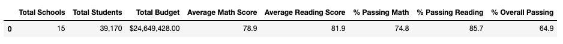
* School summary
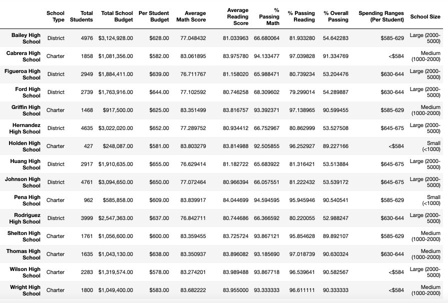
* Top 5 performing schools, based on the overall passing rate
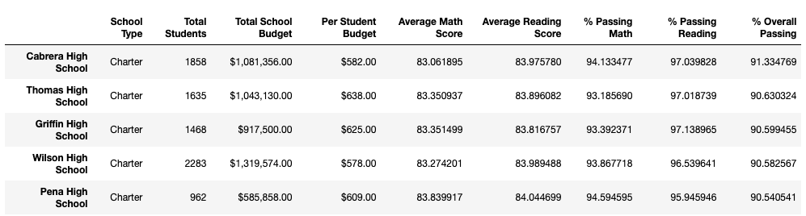
* Bottom 5 performing schools, based on the overall passing rate
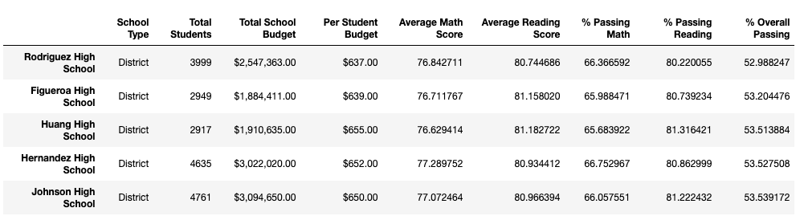
* Average math score for each grade level from each school

* Average reading score for each grade level from each school
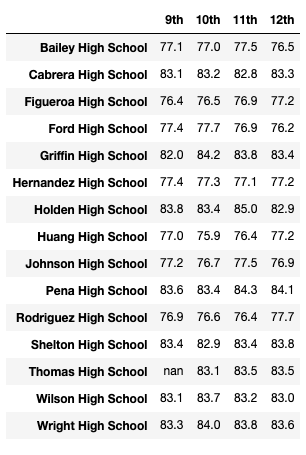

* Scores by school spending per student
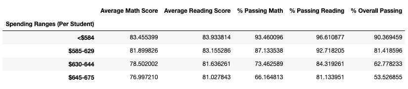
* Scores by school spending per student, by school size
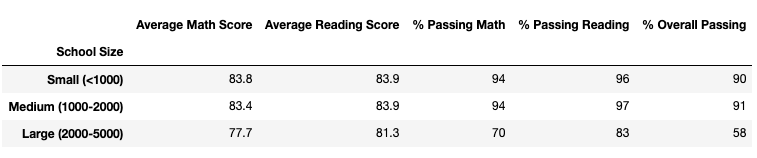
* Scores by school spending per student by school type
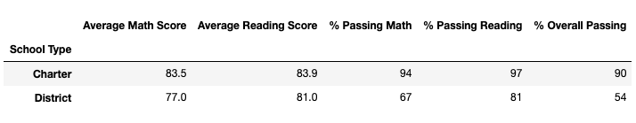

### When comparing the compromised data with the refactored one, following are highlights and questions answered:
* The district summary % overall passing went from 65.17% to 64.9%.
* The school summary stayed the same except for the results of Thomas High School. 
* How did replacing the ninth graders’ math and reading scores affect Thomas High School’s performance relative to the other schools?
    - Even with the refactored results, Thomas High School still ranks second however Thomas High School's % passing math, % passing reading and % overall passing changed.
    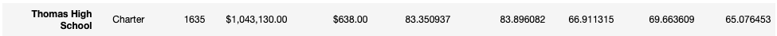
    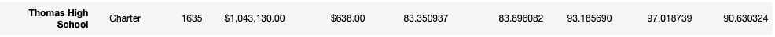
* How did replacing the ninth grade scores affect the math and reading scores by grade?
    - The scores by grade stayed the same except “nan” listed for Thomas ninth grade.
    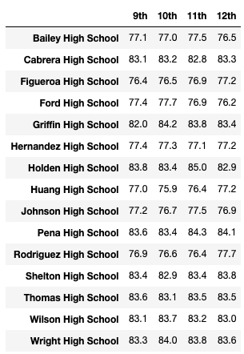 
    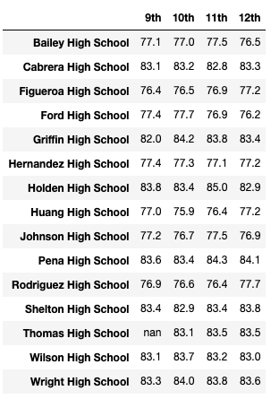
* How did replacing the ninth-grade scores the following?:
    - Scores by school spending - not affected
    - Scores by school size - not affected
    - Scores by school type - not affected

## Summary
After the Thomas High School ninth grade reading and math scores were replaced the % overall passing in the district summary decreased. The school summary stayed the same except for the results of Thomas High School which had changes to the % passing math, % passing reading and % overall passing. The top and bottom school rankings stayed the same, however the ranking of Thomas High School slightly decreased. The scores by school spending, school size, and school type remained the same.